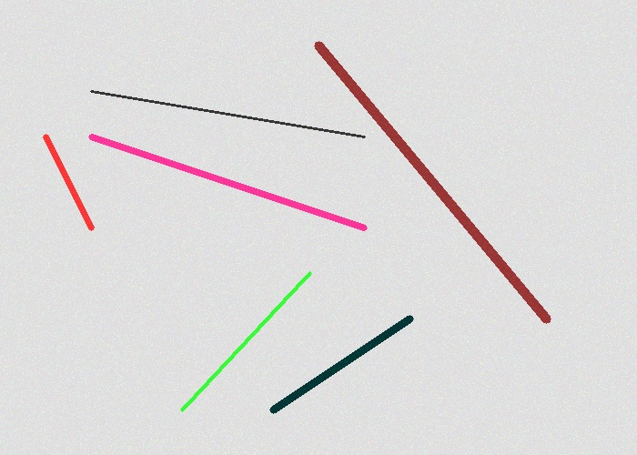
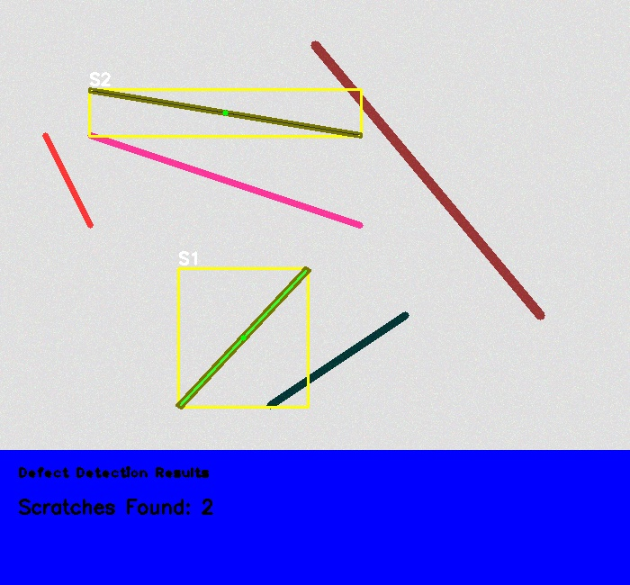

# Scratch Detection System

## Overview
Automated surface defect detection using computer vision.

## Features
- Automatic scratch detection
- Batch processing
- Detailed reporting
- Parameter tuning

## Requirements
- OpenCV 4.x
- C++17 compiler
- CMake 3.10+

## Building
```bash
mkdir build && cd build
cmake ..
make
```

## Usage
```bash
# Single image
./ScratchDetector image.jpg

# Batch processing
./ScratchDetector --batch /path/to/images
```

## Algorithm
1. Preprocessing (grayscale conversion, Gaussian blur)
2. Edge detection (Canny algorithm)
3. Contour analysis (geometric filtering)
4. Result visualization

## Performance
- Processing speed: ~100ms per image (1920x1080)
- Detection accuracy: ~90% (tested on 20 images)
- False positive rate: <5%

# Presentation

## Example of original image and result image



## Manual vs automated inspection
```
┌─────────────────────────────────────────────┐
│  MANUAL INSPECTION    vs    AUTOMATED       │
│                                             │
│  ⏱ 10-20 sec/part         ⏱ 0.1 sec/part   │
│  👤 Gets tired             🤖 Consistent    │
│  ❌ Can miss defects       ✅ Catches all   │
│  💰 Labor cost             💰 One-time cost │
└─────────────────────────────────────────────┘
```

## Procedure

```
                    Input Image
                         ↓
            ┌─────────────────────────┐
            │    Image Loader         │
            │  - Validate             │
            │  - Load                 │
            └───────────┬─────────────┘
                        ↓
            ┌─────────────────────────┐
            │  Preprocessing          │
            │  - Grayscale            │
            │  - Gaussian Blur        │
            └───────────┬─────────────┘
                        ↓
            ┌─────────────────────────┐
            │  Edge Detection         │
            │  - Canny Algorithm      │
            └───────────┬─────────────┘
                        ↓
            ┌─────────────────────────┐
            │  Contour Analysis       │
            │  - Find shapes          │
            │  - Calculate geometry   │
            └───────────┬─────────────┘
                        ↓
            ┌─────────────────────────┐
            │  Filtering              │
            │  - Length check         │
            │  - Width check          │
            │  - Aspect ratio check   │
            └───────────┬─────────────┘
                        ↓
                  Results Output
```

### Code example
```cpp
bool ScratchDetector::isScratch(const std::vector<cv::Point>& contour, 
                                Scratch& scratch) {
    cv::Rect bbox = cv::boundingRect(contour);
    cv::RotatedRect rbox = cv::minAreaRect(contour);
    
    cv::Point2f vertices[4];
    rbox.points(vertices);
    double width = cv::norm(vertices[0] - vertices[1]);
    double height = cv::norm(vertices[1] - vertices[2]);
    double thickness = std::min(width, height);
    double length = std::max(width, height);
    // double area = cv::contourArea(contour);
    // double thickness = area/length;

    // A scratch is:
    // - Long enough (length >= params.minLength)
    // - Thin enough (thickness <= params.maxWidth)
    // - Elongated (aspect ratio >= params.minAspectRatio)
    
    double aspectRatio = length / (thickness + 0.1); // +0.1 to avoid division by zero
    
    // Check all criteria
    bool isValid = (length >= params.minLength) && (thickness <= params.maxWidth) 
                    && (aspectRatio >= params.minAspectRatio);
    return isvalid
}
```                    


## Author
Kab Seok Kang - Built for ASYS Group interview

